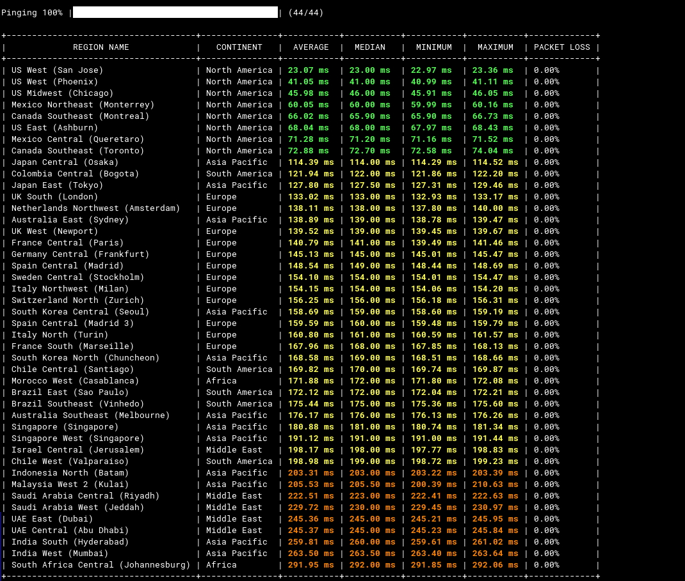

# OCI Ping CLI

一个用于测试 Oracle Cloud Infrastructure (OCI) 各个区域网络延迟的 Go 语言命令行工具。



## 功能特点

- **多平台支持**：支持 macOS (ARM), Windows (x64), Linux (x86_64) 和 Linux (ARM64)。
- **并发探测**：使用 Goroutines 并发测试所有区域的延迟，速度极快。
- **详细指标**：显示每个区域的最小、平均、最大和中位数延迟。
- **彩色输出**：在终端中使用颜色标识不同的延迟范围（仅限 Mac/Linux）。
- **进度显示**：实时显示探测进度。
- **结果导出**：支持通过 `--save` 参数将测试结果保存为带时间戳的 CSV 文件。
- **自定义配置**：支持通过 `-n` 指定每个区域的探测次数，或通过 `--regions-list` 使用自定义的区域 JSON。

## 安装与运行

### 一键运行 (Mac/Linux)

如果您不想手动下载，可以使用以下命令直接运行（如果遇到权限问题，请切换到 root 用户执行）：

```bash
bash <(curl -sL https://ghfast.top/raw.githubusercontent.com/mark-floyd/oci-ping/main/oci-ping.sh)
```

> **注意**：Linux 用户通常需要以 root 用户身份运行。

### 直接运行二进制文件

您可以直接运行对应平台的二进制文件：

- **Windows**: 从 [Release 页面](https://github.com/mark-floyd/oci-ping/releases) 下载 `.exe` 文件，然后在终端中运行：`.\oci-ping-cli-win-x64.exe`
- **Mac (ARM)**: `./oci-ping-cli-darwin-arm64`
- **Linux**: `./oci-ping-cli-linux-x64` (或 `linux-arm64`)

## 命令行参数

- `-n`: 每个区域的 ping 次数（默认为 10）。
- `--regions-list`: 指定区域 JSON 文件的路径或 URL。
- `--save`: 将结果保存为带时间戳的 CSV 文件。
- `-v`: 启用详细输出。

## 延迟颜色说明 (终端)

- **绿色**: < 100ms (延迟低)
- **黄色**: 100ms - 200ms (延迟中等)
- **橙色**: 200ms - 300ms (延迟较高)
- **红色**: > 300ms (延迟高)

## 数据来源

默认从 GitHub 获取最新的 OCI 区域列表：`https://ghfast.top/raw.githubusercontent.com/mark-floyd/oci-ping/refs/heads/main/regions.json`

## 许可证

MIT
